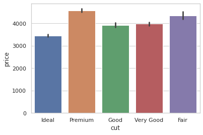
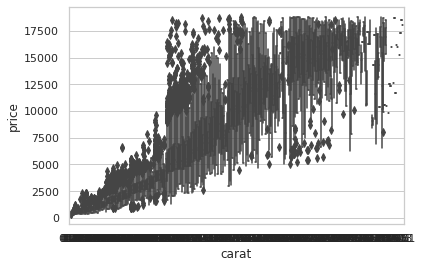
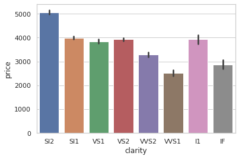

<h1>TP DATAMINING</h1>

<h2>1. Problématiques</h2>

> A ce stade les données ne sont pas facilement exploitable.
> En effet, il y a beaucoup trop de données, et il faut donc élabober différentes analyses qui permerttront d'avoir un rendu graphique facilitant l'interprétation de celles-ci.
> Néanmoins, les problématiques que nous pouvons mettre en avant, sont de savoir par exemple si il y'a une corrélation entre le prix et le carat, le prix et la qualité, et le prix et la clarté des diamants.

<h2>2. Analyse univariée</h2>

<h3>Étape 1 : Import des librairies et chargement du fichier csv (dataset)</h3>

```python
import pandas as pd
import matplotlib.pyplot as plt
import seaborn as sns
df = pd.read_csv('/home/ubuntu/Documents/DATAMINING/diamonds.csv')
```

<h3>Étape 2 : Vérification si le fichier csv est bien chargé</h3>

```python
df.shape
(53940, 10)
```

> La commande df.shape permet de connaître le nombre de lignes et de colonnes : Ici nous avons 53 940 lignes et 10 colonnes
    
    
<h3>Étape 3 : Affichage d'un tableau permettant d'avoir le total des diamants en fonction de la qualité (cut)</h3>

```python
df.groupby(['cut']).count()
```

<div>
<table border="1" class="dataframe">
  <thead>
    <tr style="text-align: right;">
      <th></th>
      <th>carat</th>
      <th>color</th>
      <th>clarity</th>
      <th>depth</th>
      <th>table</th>
      <th>price</th>
      <th>x</th>
      <th>y</th>
      <th>z</th>
    </tr>
    <tr>
      <th>cut</th>
      <th></th>
      <th></th>
      <th></th>
      <th></th>
      <th></th>
      <th></th>
      <th></th>
      <th></th>
      <th></th>
    </tr>
  </thead>
  <tbody>
    <tr>
      <th>Fair</th>
      <td>1610</td>
      <td>1610</td>
      <td>1610</td>
      <td>1610</td>
      <td>1610</td>
      <td>1610</td>
      <td>1610</td>
      <td>1610</td>
      <td>1610</td>
    </tr>
    <tr>
      <th>Good</th>
      <td>4906</td>
      <td>4906</td>
      <td>4906</td>
      <td>4906</td>
      <td>4906</td>
      <td>4906</td>
      <td>4906</td>
      <td>4906</td>
      <td>4906</td>
    </tr>
    <tr>
      <th>Ideal</th>
      <td>21551</td>
      <td>21551</td>
      <td>21551</td>
      <td>21551</td>
      <td>21551</td>
      <td>21551</td>
      <td>21551</td>
      <td>21551</td>
      <td>21551</td>
    </tr>
    <tr>
      <th>Premium</th>
      <td>13791</td>
      <td>13791</td>
      <td>13791</td>
      <td>13791</td>
      <td>13791</td>
      <td>13791</td>
      <td>13791</td>
      <td>13791</td>
      <td>13791</td>
    </tr>
    <tr>
      <th>Very Good</th>
      <td>12082</td>
      <td>12082</td>
      <td>12082</td>
      <td>12082</td>
      <td>12082</td>
      <td>12082</td>
      <td>12082</td>
      <td>12082</td>
      <td>12082</td>
    </tr>
  </tbody>
</table>
</div>

<h3>Étape 4 : Création des différents  graphiques pertinents</h3>

<h4>Cut / Price</h4>

```python
sns.barplot(x='cut', y='price', data=df)
```


<h4>Cara / Price</h4>

```python
sns.boxplot(x='carat', y='price', data=df)
```


<h4>Clarity / Price</h4>

```python
sns.barplot(x='clarity', y='price', data=df)
```


<h2>2.a Description des diamants</h2>

Le tableau faisant référence à la quantité en fonction de la qualité des diamants, nous montre que nous avons beaucoup plus de diamants de bonnes qualités par rapport aux qualités les plus basses.
De plus au niveaux des prix, nous pouvons remarquer une corrélation entre la taille du carat et son prix.
Néanmoins, on remarque que la qualité et la clarté ne sont pas les caractéristiques qui impactent les prix d'une manière significative, contrairement aux carats.

<h2>2.b Description des diamants</h2>

Les anomalies remarquées sont la non corrélation entre le prix et la qualité, et le prix et la clarté. 
Il serait donc plus judicieux de se baser sur le nombre de carats pour déterminer et prévoir les prix.

<h2>3. Analyse bivariée / tri variée</h3>

