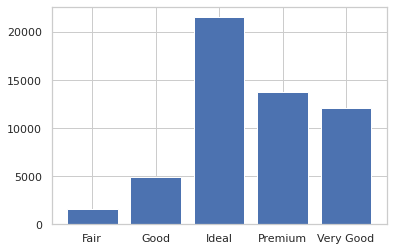

# DATAMINING

## Analyse univariée

### Étape 1 : Import des librairies et chargement du fichier csv (dataset)

```python
import pandas as pd
import matplotlib.pyplot as plt
df = pd.read_csv('/home/ubuntu/Documents/DATAMINING/diamonds.csv')
```

### Étape 2 : Vérification si le fichier csv est bien chargé

```python
df.shape
(53940, 10)
```

> La commande df.shape permet de connaître le nombre de lignes et de colonnes : Ici nous avons 53 940 lignes et 10 colonnes
    
    
```python
df.head()
```

> La commande df.head() permet d'avoir un affichage des premières lignes du tableau, et permet donc de s'assurer aussi que nous avons chargé le bon fichier

<div>
<table border="1" class="dataframe">
  <thead>
    <tr style="text-align: right;">
      <th></th>
      <th>carat</th>
      <th>cut</th>
      <th>color</th>
      <th>clarity</th>
      <th>depth</th>
      <th>table</th>
      <th>price</th>
      <th>x</th>
      <th>y</th>
      <th>z</th>
    </tr>
  </thead>
  <tbody>
    <tr>
      <th>0</th>
      <td>0.23</td>
      <td>Ideal</td>
      <td>E</td>
      <td>SI2</td>
      <td>61.5</td>
      <td>55.0</td>
      <td>326</td>
      <td>3.95</td>
      <td>3.98</td>
      <td>2.43</td>
    </tr>
    <tr>
      <th>1</th>
      <td>0.21</td>
      <td>Premium</td>
      <td>E</td>
      <td>SI1</td>
      <td>59.8</td>
      <td>61.0</td>
      <td>326</td>
      <td>3.89</td>
      <td>3.84</td>
      <td>2.31</td>
    </tr>
    <tr>
      <th>2</th>
      <td>0.23</td>
      <td>Good</td>
      <td>E</td>
      <td>VS1</td>
      <td>56.9</td>
      <td>65.0</td>
      <td>327</td>
      <td>4.05</td>
      <td>4.07</td>
      <td>2.31</td>
    </tr>
    <tr>
      <th>3</th>
      <td>0.29</td>
      <td>Premium</td>
      <td>I</td>
      <td>VS2</td>
      <td>62.4</td>
      <td>58.0</td>
      <td>334</td>
      <td>4.20</td>
      <td>4.23</td>
      <td>2.63</td>
    </tr>
    <tr>
      <th>4</th>
      <td>0.31</td>
      <td>Good</td>
      <td>J</td>
      <td>SI2</td>
      <td>63.3</td>
      <td>58.0</td>
      <td>335</td>
      <td>4.34</td>
      <td>4.35</td>
      <td>2.75</td>
    </tr>
  </tbody>
</table>
</div>


```python
df.groupby(['cut']).count()
```

<div>

<table border="1" class="dataframe">
  <thead>
    <tr style="text-align: right;">
      <th></th>
      <th>carat</th>
      <th>color</th>
      <th>clarity</th>
      <th>depth</th>
      <th>table</th>
      <th>price</th>
      <th>x</th>
      <th>y</th>
      <th>z</th>
    </tr>
    <tr>
      <th>cut</th>
      <th></th>
      <th></th>
      <th></th>
      <th></th>
      <th></th>
      <th></th>
      <th></th>
      <th></th>
      <th></th>
    </tr>
  </thead>
  <tbody>
    <tr>
      <th>Fair</th>
      <td>1610</td>
      <td>1610</td>
      <td>1610</td>
      <td>1610</td>
      <td>1610</td>
      <td>1610</td>
      <td>1610</td>
      <td>1610</td>
      <td>1610</td>
    </tr>
    <tr>
      <th>Good</th>
      <td>4906</td>
      <td>4906</td>
      <td>4906</td>
      <td>4906</td>
      <td>4906</td>
      <td>4906</td>
      <td>4906</td>
      <td>4906</td>
      <td>4906</td>
    </tr>
    <tr>
      <th>Ideal</th>
      <td>21551</td>
      <td>21551</td>
      <td>21551</td>
      <td>21551</td>
      <td>21551</td>
      <td>21551</td>
      <td>21551</td>
      <td>21551</td>
      <td>21551</td>
    </tr>
    <tr>
      <th>Premium</th>
      <td>13791</td>
      <td>13791</td>
      <td>13791</td>
      <td>13791</td>
      <td>13791</td>
      <td>13791</td>
      <td>13791</td>
      <td>13791</td>
      <td>13791</td>
    </tr>
    <tr>
      <th>Very Good</th>
      <td>12082</td>
      <td>12082</td>
      <td>12082</td>
      <td>12082</td>
      <td>12082</td>
      <td>12082</td>
      <td>12082</td>
      <td>12082</td>
      <td>12082</td>
    </tr>
  </tbody>
</table>
</div>


```python
freq_table = df.groupby(['cut']).size().reset_index(name='Total').rename(columns={'cut': 'Qualité'})
freq_table
```

<div>
<table border="1" class="dataframe">
  <thead>
    <tr style="text-align: right;">
      <th></th>
      <th>Qualité</th>
      <th>Total</th>
    </tr>
  </thead>
  <tbody>
    <tr>
      <th>0</th>
      <td>Fair</td>
      <td>1610</td>
    </tr>
    <tr>
      <th>1</th>
      <td>Good</td>
      <td>4906</td>
    </tr>
    <tr>
      <th>2</th>
      <td>Ideal</td>
      <td>21551</td>
    </tr>
    <tr>
      <th>3</th>
      <td>Premium</td>
      <td>13791</td>
    </tr>
    <tr>
      <th>4</th>
      <td>Very Good</td>
      <td>12082</td>
    </tr>
  </tbody>
</table>
</div>

```python
import matplotlib.pyplot as plt
plt.bar(freq_table['Qualité'], freq_table['Total'])
```
    

    

```python
freq_table['Total%'] = freq_table['Total']/sum(freq_table['Total'])*100
freq_table
```

<div>
<table border="1" class="dataframe">
  <thead>
    <tr style="text-align: right;">
      <th></th>
      <th>Qualité</th>
      <th>Total</th>
      <th>Total%</th>
    </tr>
  </thead>
  <tbody>
    <tr>
      <th>0</th>
      <td>Fair</td>
      <td>1610</td>
      <td>2.984798</td>
    </tr>
    <tr>
      <th>1</th>
      <td>Good</td>
      <td>4906</td>
      <td>9.095291</td>
    </tr>
    <tr>
      <th>2</th>
      <td>Ideal</td>
      <td>21551</td>
      <td>39.953652</td>
    </tr>
    <tr>
      <th>3</th>
      <td>Premium</td>
      <td>13791</td>
      <td>25.567297</td>
    </tr>
    <tr>
      <th>4</th>
      <td>Very Good</td>
      <td>12082</td>
      <td>22.398962</td>
    </tr>
  </tbody>
</table>
</div>


```python

```
